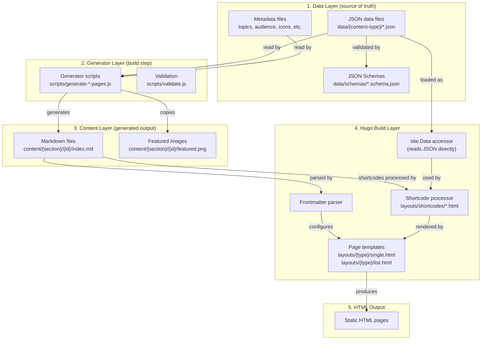
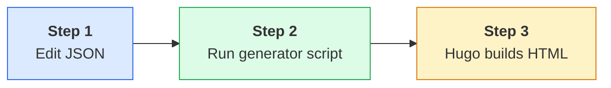
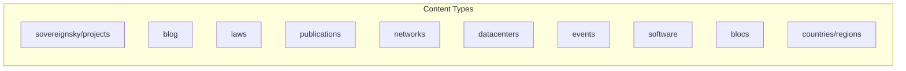
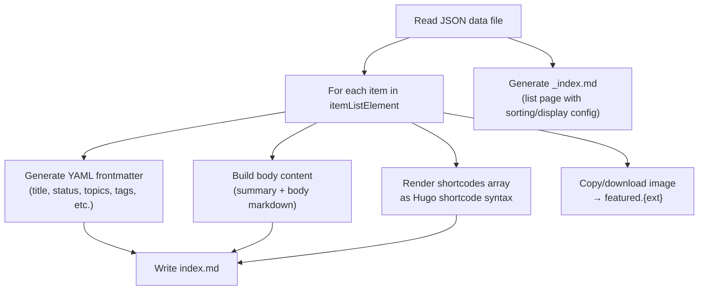
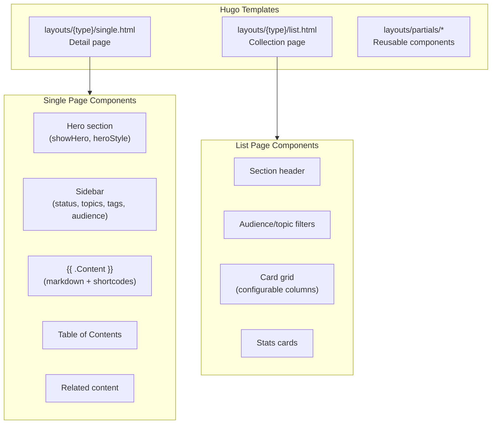
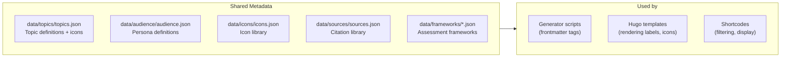
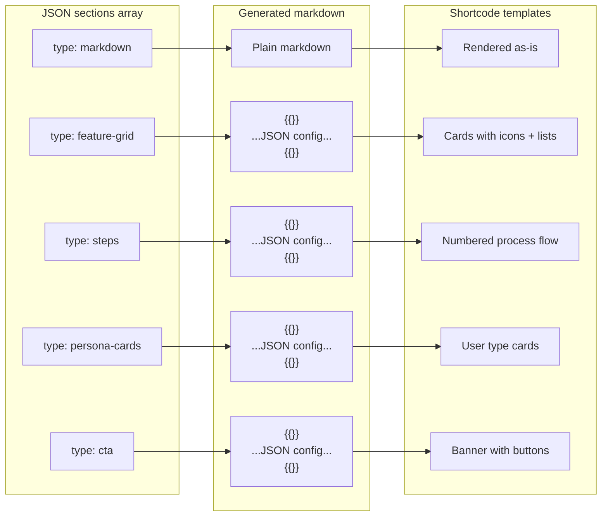
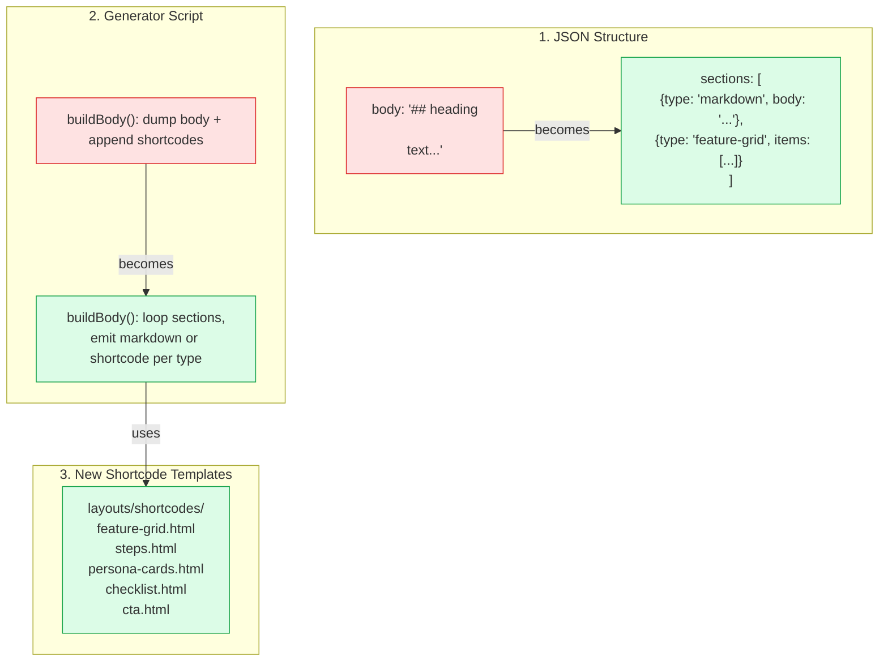

# Data Pipeline: JSON to HTML

How content flows from JSON data files through generator scripts, into Hugo markdown, and out as styled HTML pages.

---

## Architecture Overview



---

## The Three-Step Build

Every page on the site is produced by three steps:



| Step | Who | What happens |
|------|-----|--------------|
| **1. Edit JSON** | Human | Add/edit content in `data/{type}/*.json` |
| **2. Run generator** | Script | `node scripts/generate-{type}-pages.js` creates markdown in `content/` |
| **3. Hugo build** | Hugo | Parses markdown, processes shortcodes, applies templates, outputs HTML |

**Important**: The markdown files in `content/` are **generated artifacts** — never edit them directly. Always edit the JSON source, then re-run the generator.

---

## Content Types

The site has 10 main content types, each following the same pipeline:



| Content Type | JSON Source | Generator Script | Output Path | Schema |
|---|---|---|---|---|
| **Projects** | `data/sovereignsky/projects.json` | `generate-sovereignsky-pages.js` | `/sovereignsky/{id}/` | `sovereignsky-projects.schema.json` |
| **Blog** | `data/blog/blog.json` | `generate-blog-pages.js` | `/blog/{id}/` | `blog.schema.json` |
| **Laws** | `data/laws/laws.json` | `generate-laws-pages.js` | `/laws/{id}/` | `laws.schema.json` |
| **Publications** | `data/publications/publications.json` | `generate-publications-pages.js` | `/publications/{id}/` | — |
| **Networks** | `data/networks/networks.json` | `generate-network-pages.js` | `/networks/{id}/` | `networks.schema.json` |
| **Datacenters** | `data/datacenters/datacenters.json` | `generate-datacenters-pages.js` | `/datacenters/{id}/` | `datacenter-provider.schema.json` |
| **Events** | `data/events/events.json` | `generate-events-pages.js` | `/events/{id}/` | `events.schema.json` |
| **Software** | `data/software/software.json` | `generate-software-pages.js` | `/software/{slug}` | `product.schema.json` |
| **Blocs** | `data/blocs/blocs.json` | `generate-blocs-pages.js` | `/countries/{bloc}/` | `blocs.schema.json` |
| **Countries** | `data/regions.json` | `generate-countries-pages.js` | `/countries/{slug}/` | `regions.schema.json` |

---

## What a Generator Script Does

All generator scripts follow the same pattern:



### Generated Markdown Structure

```markdown
---
title: "Project Name"              ← from JSON name
identifier: "project-id"           ← from JSON identifier
weight: 20                         ← sorting weight
date: 2024-01-01                   ← from project.dateStarted
description: "..."                 ← from JSON description
summary: "..."                     ← from JSON abstract
status: "active"                   ← from project.status
repository: "https://github..."    ← from project.repository
topics:
  - "cybersecurity"                ← from JSON topics array
tags:
  - "docker"                       ← from JSON tags array
audience:
  - "developer"                    ← from JSON audience array
showHero: true
heroStyle: "big"
layout: "single"
type: "sovereignsky"
---

Summary text from JSON summary field.

Body markdown from JSON body field.


{"key": "value", "items": [...]}

```

---

## Shortcodes: Two Categories

Hugo shortcodes bridge the gap between markdown content and rich HTML rendering.

```mermaid
flowchart TB
    subgraph datadriven["Data-Driven Shortcodes"]
        direction TB
        DD1["network-map"]
        DD2["datacenter-map"]
        DD3["jurisdiction-laws"]
        DD4["bloc-cards"]
        DD5["laws-list"]
        DD6["...and 15 more"]
    end

    subgraph content_sc["Content Shortcodes"]
        direction TB
        CS1["card / cards"]
        CS2["figure"]
        CS3["echart"]
        CS4["mermaid"]
        CS5["survey"]
    end

    subgraph future["Planned: Section Design Shortcodes"]
        direction TB
        FS1["feature-grid"]
        FS2["steps"]
        FS3["persona-cards"]
        FS4["checklist"]
        FS5["cta"]
        FS6["stats"]
    end

    SITEDATA["site.Data<br/>(all JSON files)"] -->|queried by| datadriven
    CONFIG["JSON config<br/>(passed inside shortcode)"] -->|parsed by| content_sc
    CONFIG2["JSON config<br/>(from sections array)"] -->|parsed by| future

    style future fill:#fef3c7,stroke:#d97706,stroke-dasharray: 5 5
```



### Data-Driven Shortcodes (existing)

These read JSON data files directly via Hugo's `site.Data` at build time:

| Shortcode | Reads from | Renders |
|---|---|---|
| `network-map` | networks.json, networks-places.json | Interactive ECharts map |
| `datacenter-map` | datacenters.json, regions.json | World map with filtering |
| `jurisdiction-laws` | laws.json, blocs.json | Laws table for a jurisdiction |
| `jurisdiction-map` | regions.json, blocs.json | Member country map |
| `bloc-cards` | blocs.json | Card grid of blocs |
| `laws-list` | laws.json | Filtered law list |
| `datacenter-*` | datacenters.json | Various datacenter views (7 shortcodes) |
| `network-*` | networks.json | Various network views (4 shortcodes) |
| `page-stats` / `stats` | Page params | Stats cards |
| `events` | events.json | Event calendar |

### Content Shortcodes (existing)

These render content passed to them:

| Shortcode | Usage |
|---|---|
| `card` / `cards` | Content cards |
| `figure` | Images with captions |
| `echart` | Chart wrapper |
| `mermaid` | Diagram embedding |
| `survey` | Form embedding |

### Section Design Shortcodes (planned)

These will power the section-based design system. See `INVESTIGATE-section-based-design.md` for full details.

| Shortcode | Renders | Needed for |
|---|---|---|
| `feature-grid` | Icon cards with item lists | Projects |
| `steps` | Numbered process flow | Projects |
| `persona-cards` | User type cards | Projects |
| `checklist` | Checkmark items | Projects |
| `cta` | Call-to-action banner | Projects |
| `stats` | Big number cards | Infrastructure/Security pages |
| `certification-grid` | Compliance badges | Security pages |
| `resource-card` | Download cards | Security pages |
| `feature-block` | Grouped sub-features | Infrastructure pages |
| `related-projects` | Project link cards | All project pages |

---

## Hugo Template Layer

Templates control the page-level layout. Content is rendered inside them via `{{ .Content }}`.



### Template configuration via frontmatter

**Single pages** (detail views):
```yaml
layout: "single"           # which template
type: "sovereignsky"        # which template folder
showHero: true              # show hero section
heroStyle: "big"            # hero variant
```

**List pages** (collection views):
```yaml
layout: "list"
sorting:
  field: weight             # sort by: weight, date, title
  direction: asc
  fallback: title
display:
  cardStyle: project        # card variant
  gridColumns: 2            # grid columns
  showAudienceFilter: true  # enable filtering
  showTopicFilter: true
  showStats: true
```

---

## Metadata Files

Shared lookup data used across content types:



| File | Purpose |
|---|---|
| `data/topics/topics.json` | Topic definitions with icons (digital-sovereignty, cybersecurity, etc.) |
| `data/audience/audience.json` | Audience personas (developer, public-sector, enterprise, etc.) |
| `data/icons/icons.json` | Icon mappings |
| `data/sources/sources.json` | Citations and references |
| `data/content-types/content-types.json` | Content category definitions |
| `data/frameworks/ndsi.json` | NDSI assessment framework |
| `data/frameworks/eu-csf.json` | EU Cybersecurity Framework |
| `data/homepage/sections.json` | Homepage section configuration |
| `data/hugo/ui_vocabulary.json` | UI term definitions |

---

## Validation

All JSON data is validated against schemas before build:

```bash
# Run inside devcontainer
docker exec $CONTAINER bash -c "cd /workspace && npm run validate"
```

Schemas are in `data/schemas/` and follow JSON Schema draft-07. The validation script (`scripts/validate.js`) checks all data files against their schemas.

---

## Complete File Map

```
data/                                    ← SOURCE OF TRUTH
├── sovereignsky/projects.json           ← Project content
├── blog/blog.json                       ← Blog posts
├── laws/laws.json                       ← Legislation
├── publications/publications.json       ← Research papers
├── networks/networks.json               ← Submarine cables
├── datacenters/datacenters.json         ← Cloud providers
├── events/events.json                   ← Conferences
├── software/software.json               ← Software catalog
├── blocs/blocs.json                     ← Geopolitical blocs
├── regions.json                         ← Countries
├── topics/topics.json                   ← Topic metadata
├── audience/audience.json               ← Persona metadata
├── schemas/*.schema.json                ← Validation schemas
└── ...                                  ← Other lookup data

scripts/                                 ← GENERATORS
├── generate-sovereignsky-pages.js
├── generate-blog-pages.js
├── generate-laws-pages.js
├── generate-publications-pages.js
├── generate-network-pages.js
├── generate-datacenters-pages.js
├── generate-events-pages.js
├── generate-software-pages.js
├── generate-blocs-pages.js
├── generate-countries-pages.js
├── generate-jurisdictions-pages.js
├── generate-datacenter-country-pages.js
├── generate-persona-pages.js
└── validate.js

content/                                 ← GENERATED (don't edit)
├── sovereignsky/{id}/index.md
├── blog/{id}/index.md
├── laws/{id}/index.md
├── publications/{id}/index.md
├── networks/{id}/index.md
├── datacenters/{id}/index.md
├── events/{id}/index.md
├── software/{slug}.md
├── countries/{slug}/index.md
└── jurisdictions/{id}/index.md

layouts/                                 ← TEMPLATES & SHORTCODES
├── sovereignsky/single.html             ← Project detail page
├── sovereignsky/list.html               ← Project list page
├── shortcodes/                          ← 28 shortcode templates
│   ├── network-map.html
│   ├── datacenter-map.html
│   ├── jurisdiction-laws.html
│   ├── feature-grid.html                ← (planned)
│   ├── steps.html                       ← (planned)
│   ├── persona-cards.html               ← (planned)
│   └── ...
└── partials/                            ← Reusable template parts
```

---

## Planned: Section-Based Design System

See **[INVESTIGATE-section-based-design.md](plans/backlog/INVESTIGATE-section-based-design.md)** for the full investigation.

### The Problem

Currently, the `body` field in JSON is flat markdown. All sections render with the same default styling. The Stitch design mockups show visually distinct sections (feature grids, persona cards, step flows, etc.).

### The Solution

Replace the `body` field with a `sections` array. Each section has a `type` that determines its design:



### What Changes



### What Stays the Same

- Hugo templates (`single.html`, `list.html`) — no changes needed
- Frontmatter generation — same fields
- Image handling — same process
- All existing shortcodes — untouched
- Projects without `sections` — keep using `body` (backward compatible)

### Reference Implementation

A working React/TypeScript version of the DevContainer Toolbox page exists at https://github.com/terchris/aistudio-sovereignsky — generated by exporting the Stitch design to Google AI Studio. The React components map directly to section types and contain the exact HTML structure and Tailwind classes to replicate in Hugo shortcodes.
